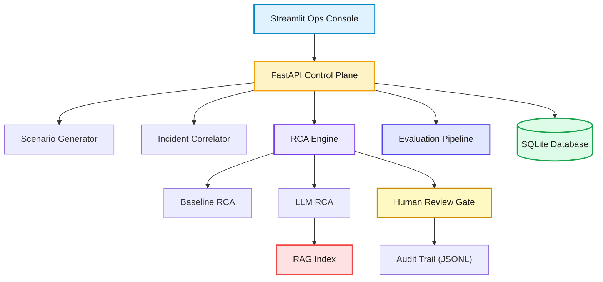

# System Architecture

TeleOps is designed as a minimal but complete workflow: from synthetic alert ingestion to incident correlation to dual-mode RCA generation. The architecture prioritizes auditability, repeatability, and a clean separation between data, control, and AI planes.

## Design Principles
- **Auditability first**: Every RCA output is stored with its evidence, model metadata, and review decisions.
- **Baseline is mandatory**: The deterministic RCA path is always available.
- **Human oversight by default**: All RCA artifacts default to `pending_review`. No hypothesis is accepted without human decision.
- **Measured quality**: Semantic evaluation pipeline scores every RCA output against ground truth.
- **Low-friction demo**: SQLite and Streamlit minimize setup for a local demo.

## High-Level Architecture

## Data Plane
The data plane is responsible for generating and storing alerts and incidents. The MVP uses synthetic alerts to simulate network degradation scenarios with configurable noise rates.

| Entity | Purpose | Key Fields |
| --- | --- | --- |
| Alert | Raw signals emitted by network systems. | `source_system`, `host`, `service`, `severity`, `tags` |
| Incident | Correlated set of alerts with shared root cause. | `related_alert_ids`, `summary`, `severity`, `status` |
| RCA Artifact | Structured RCA output with evidence and review state. | `hypotheses`, `confidence_scores`, `evidence`, `duration_ms`, `status`, `reviewed_by`, `reviewed_at` |

Noise filtering is percentile-based: tags at or below the 25th percentile of alert counts (per batch) are dropped after the `min_alerts` guardrail.

## Control Plane
FastAPI orchestrates the workflow: generating scenarios, correlating incidents, and launching RCA generation. The API provides a simple contract for UI integration and future automation.

## AI Plane
The AI plane combines a deterministic baseline (11 pattern-matching rules) with LLM reasoning. LLM requests include a structured incident payload, up to 20 alert samples, and top-6 RAG context chunks retrieved from 14 runbooks. The response is validated for JSON structure before persistence. Duration is tracked via `duration_ms` on each artifact.

## Review Plane
All RCA artifacts default to `pending_review` status. The review plane provides accept/reject endpoints with required reviewer identification and optional notes. Every review decision is appended to `storage/audit_log.jsonl` for immutable audit trail. The Observability dashboard surfaces review acceptance rates and decision quality metrics.

## Evaluation Plane
The evaluation pipeline runs 50 scenarios across 11 incident types with deterministic seeds. Each RCA hypothesis is scored against ground truth using semantic cosine similarity (`sentence-transformers/all-MiniLM-L6-v2`). The pipeline computes precision, recall, wrong-but-confident rate, and confidence calibration metrics. Results are surfaced on the Observability dashboard.

## Storage Layer
- **SQLite**: Stores alerts, incidents, and RCA artifacts for demo traceability.
- **RAG index**: LlamaIndex persists vector indices under `storage/rag_index`.
- **Audit log**: Append-only JSONL at `storage/audit_log.jsonl` for human review decisions.

## Key Architectural Tradeoffs
- **SQLite vs Postgres**: SQLite keeps the demo local and simple; a production rollout would move to Postgres.
- **Rule-based correlation**: Chosen for interpretability in MVP; ML clustering is a future enhancement.
- **Streamlit UI**: Fast for demos, not intended as a production NOC console.
